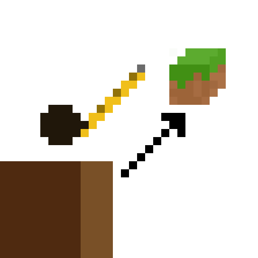

  
  <h1>Range Finder</h1>
The mod will help you measure the distance from the player to the block he is looking at. When you click on the "K" button, the coordinates and distance to the block will be displayed in the chat.

